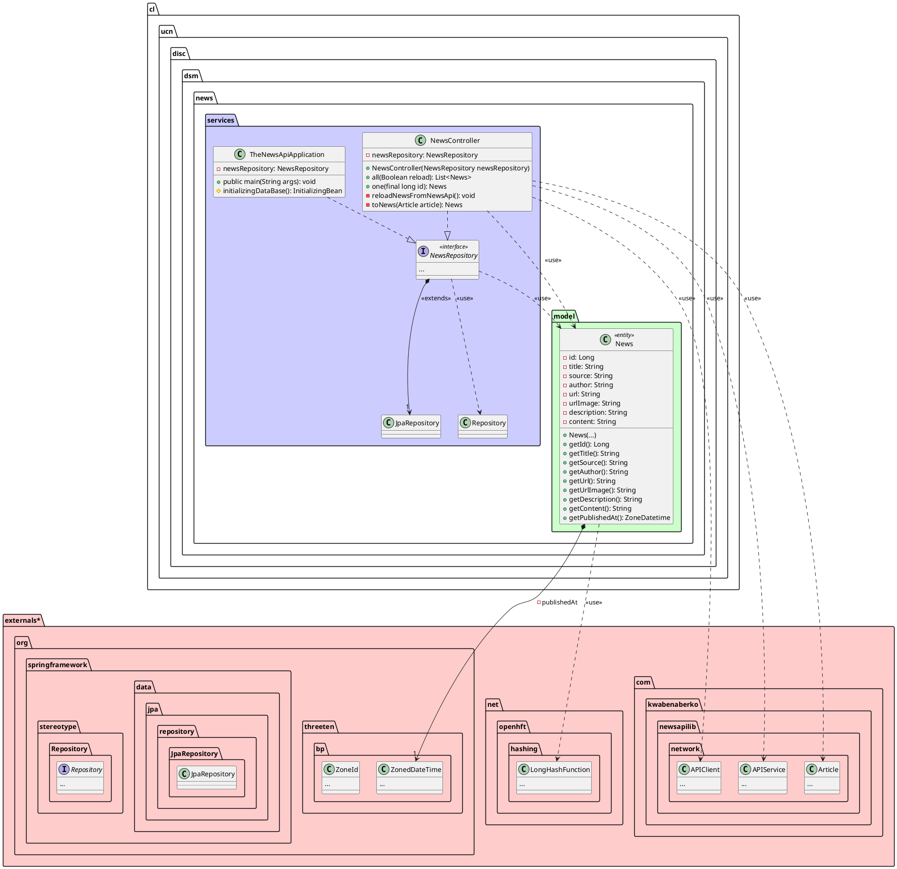

## The News API REST Project
***
(c) 2021 Desarrollo de Soluciones Móviles

### Class Model

```puml
@startuml
package externals* #ffcccc{
    package org.threeten.bp{
        class ZonedDateTime{
            ...
        }
        class ZoneId{
            ...
        }
    }
    package net.openhft.hashing{
        class LongHashFunction{
            ...
        }
    }
    
    package org.springframework{
    
        package data.jpa.repository.JpaRepository{
            class JpaRepository{
                ..
            }
        }
        package stereotype.Repository{
            interface Repository{
                ...
            }
        }
        
    }
    
    package com.kwabenaberko.newsapilib.network{
        class APIClient{
            ...
        }
        class APIService{
            ...
        }
        class Article{
            ...
        }
    }
    
    
   
}

package cl.ucn.disc.dsm.news{
    package model #ccffcc {
    
        class News <<entity>>{
            - id: Long
            - title: String
            - source: String
            - author: String
            - url: String
            - urlImage: String
            - description: String
            - content: String
            + News(...)
            + getId(): Long
            + getTitle(): String
            + getSource(): String
            + getAuthor(): String
            + getUrl(): String
            + getUrlImage(): String
            + getDescription(): String
            + getContent(): String
            + getPublishedAt(): ZoneDatetime
        }
        News *--> "1" ZonedDateTime: - publishedAt
        News ..> LongHashFunction: <<use>>
    }
    
    package services #ccccff{
        interface NewsRepository <<interface>>{
            ...
        }
        NewsRepository ..> News : <<use>>
        NewsRepository *--> "1" JpaRepository: <<extends>>
        NewsRepository ..> Repository: <<use>>
        
        class NewsController  {
             - newsRepository: NewsRepository 
             + NewsController(NewsRepository newsRepository)
             + all(Boolean reload): List<News>
             + one(final long id): News
             - reloadNewsFromNewsApi(): void
             - toNews(Article article): News
        }
        NewsController ..> News: <<use>>
        NewsController ..> APIClient: <<use>>
        NewsController ..> APIService: <<use>>
        NewsController ..> Article: <<use>>
        NewsController ..|> NewsRepository
        
        class TheNewsApiApplication{
            - newsRepository: NewsRepository 
            + public main(String args): void
            # initializingDataBase(): InitializingBean
        }
        TheNewsApiApplication ..|> NewsRepository
    }
}
@enduml
```

## Licence
[MIT](https://choosealicense.com/licenses/mit/)
